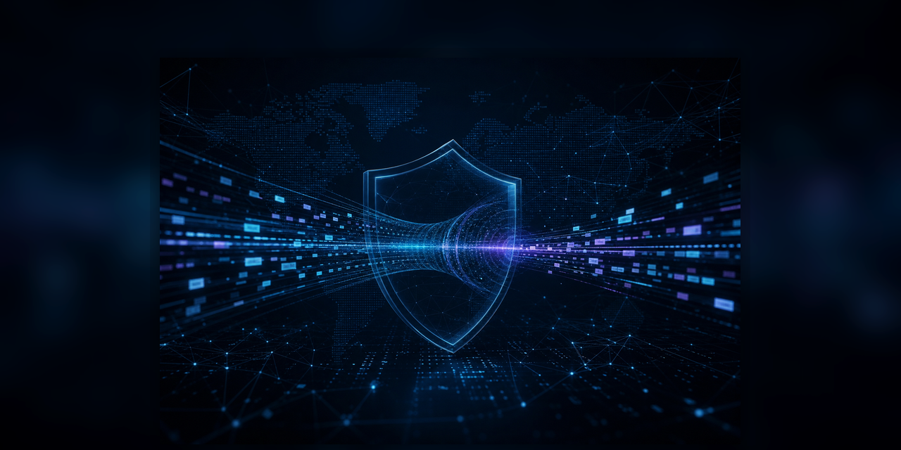
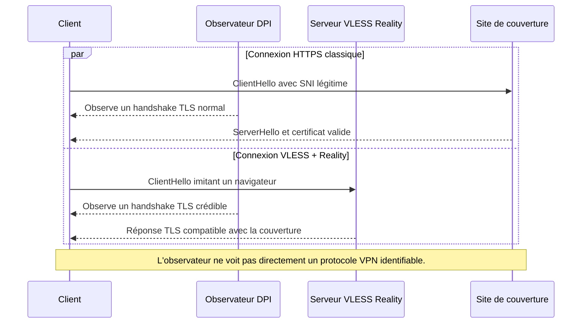

Les protocoles de contournement réseau ont beaucoup évolué. Pendant longtemps, un VPN classique suffisait à retrouver un accès stable à Internet depuis un réseau filtré. OpenVPN, WireGuard, Shadowsocks, Trojan ou VMess ont chacun eu leur période de popularité. Le problème, c'est que les systèmes de filtrage ont évolué eux aussi. Les pare-feux modernes ne se contentent plus de bloquer une adresse IP ou un port. Ils observent les paquets, comparent les empreintes TLS, lancent des sondes actives et analysent les comportements statistiques du trafic.

Dans ce contexte, VLESS associé à Reality est souvent présenté comme une approche plus robuste. L'idée n'est pas seulement de chiffrer le trafic. L'objectif est de le rendre difficile à distinguer d'une connexion HTTPS normale. C'est une différence majeure : un trafic chiffré peut quand même être repéré s'il possède une signature inhabituelle, alors qu'un trafic qui ressemble exactement à une navigation web ordinaire offre moins de points d'accroche à un système de censure ou de filtrage.

Cet article synthétise et reformule les éléments techniques issus de deux ressources : l'article Meridian sur VLESS + Reality et l'article Habr sur VLESS face à la censure moderne. Le but est de construire une explication complète, lisible et utile pour comprendre les mécanismes en jeu, sans se limiter à une simple comparaison de protocoles.

> Note d'usage : les technologies décrites ici peuvent servir à protéger la confidentialité, tester des architectures réseau ou contourner des filtrages abusifs. Elles doivent être utilisées dans un cadre légal et responsable, sur des systèmes que vous administrez ou que vous êtes autorisé à tester.

## Le problème : le chiffrement ne suffit plus

On pourrait penser qu'un protocole VPN chiffré est automatiquement indétectable. En pratique, ce n'est pas le cas. Le chiffrement empêche de lire le contenu, mais il ne masque pas forcément la forme du trafic. Un observateur réseau peut encore voir :

- l'adresse IP de destination ;
- le port utilisé ;
- la taille des paquets ;
- la fréquence des échanges ;
- l'ordre des messages pendant le handshake ;
- certains champs visibles avant l'établissement complet du chiffrement ;
- le comportement du serveur lorsqu'il reçoit une requête invalide.

Un système de DPI, pour Deep Packet Inspection, exploite précisément ces informations. Il ne cherche pas toujours à casser le chiffrement. Souvent, il suffit d'identifier que le flux ressemble à un protocole interdit ou suspect.

C'est le point central : un protocole peut être cryptographiquement solide mais opérationnellement visible. WireGuard en est un bon exemple. Il est rapide, simple et sûr, mais son handshake a une structure reconnaissable. OpenVPN est également robuste côté sécurité, mais très identifiable côté réseau. La discrétion n'est donc pas seulement une question de cryptographie. C'est aussi une question d'apparence.

## Comment le DPI identifie un protocole

Les systèmes modernes de filtrage utilisent généralement plusieurs méthodes en parallèle. Chaque méthode donne un signal différent. Quand plusieurs signaux convergent, le trafic peut être ralenti, bloqué ou envoyé vers une analyse plus poussée.

### 1. L'empreinte protocolaire

Chaque protocole possède une manière particulière de démarrer une connexion. Même lorsque le contenu applicatif est chiffré, le début de la communication peut révéler une structure stable : opcodes, tailles fixes, champs ordonnés, messages attendus, séquences de paquets.

Un exemple simplifié pour OpenVPN ressemble à ceci :

```text
Opcode: P_CONTROL_HARD_RESET_CLIENT_V2
Session ID: [8 octets aléatoires]
Packet ID: 0x00000001
Message packet-ID: [4 octets]
```

Le contenu peut être protégé, mais la silhouette reste reconnaissable. Pour un système de DPI, c'est comparable à reconnaître un type de véhicule à sa forme générale, même sans voir le conducteur.

WireGuard a un problème similaire : son premier message de handshake a une structure compacte et efficace, mais suffisamment stable pour être reconnue. Cette visibilité n'est pas un défaut de sécurité cryptographique. C'est une conséquence de sa conception : WireGuard a été pensé pour être simple, moderne et performant, pas pour imiter parfaitement une navigation web.

### 2. L'analyse statistique du trafic

Même sans signature directe, un flux peut trahir sa nature par ses statistiques. Les systèmes de filtrage observent par exemple :

- la taille moyenne des paquets ;
- la distribution des tailles ;
- les intervalles entre paquets ;
- le ratio montant et descendant ;
- la durée des sessions ;
- les patterns de petits paquets de contrôle suivis de gros paquets de données.

Un flux vidéo, une navigation web classique, un tunnel VPN et une session interactive n'ont pas exactement le même comportement. Des modèles statistiques ou des modèles de machine learning peuvent apprendre ces différences. Dans des environnements fortement filtrés, ce type d'analyse peut suffire à repérer un trafic anormal, même si le protocole précis n'est pas identifié avec certitude.

### 3. Le probing actif

Le probing actif est plus agressif. Lorsqu'un système de DPI soupçonne qu'un serveur héberge un proxy, il peut tenter de s'y connecter lui-même. Il envoie alors des requêtes spécialement construites pour provoquer une réponse caractéristique.

Si le serveur répond comme un serveur Shadowsocks, Trojan, VMess ou autre protocole connu, son identité est confirmée. L'adresse IP ou le domaine peuvent ensuite être bloqués.

Cette méthode est redoutable parce qu'elle ne se contente pas d'observer. Elle interroge directement le serveur. Un protocole réellement discret doit donc répondre correctement aux clients légitimes, tout en ayant l'air banal ou inoffensif pour les clients non autorisés.

## Pourquoi les anciens protocoles deviennent visibles

Chaque protocole historique répondait à un besoin spécifique. Leur visibilité actuelle ne signifie pas qu'ils sont inutiles, mais qu'ils ne sont pas tous adaptés aux environnements fortement surveillés.

| Protocole | Points forts | Limites face au DPI |
| --- | --- | --- |
| OpenVPN | Mature, stable, très documenté | Handshake reconnaissable, overhead important, empreinte connue |
| WireGuard | Rapide, simple, moderne | Paquets de handshake fixes, pas conçu pour la furtivité |
| Shadowsocks | Léger, simple à déployer | Entropie et réponses spécifiques détectables, sensible au probing |
| Trojan | Cherche à imiter HTTPS | Peut répondre de manière caractéristique aux sondes invalides |
| VMess | Intégré à V2Ray, chiffré | Structure plus complexe, patterns internes observables selon configuration |
| VLESS + Reality | Minimaliste, camouflage TLS, anti-probing | Dépend fortement de la qualité de configuration et de l'infrastructure |

Le point commun des protocoles détectables est qu'ils donnent au filtrage quelque chose à reconnaître. Cela peut être une séquence de handshake, une taille de paquet, un comportement d'erreur ou une différence subtile avec un navigateur réel.

## VLESS : un protocole volontairement minimaliste

VLESS signifie Very Lightweight Encryption Security Stream. Il est issu de l'écosystème V2Ray/Xray et peut être vu comme une évolution de VMess. Sa philosophie est différente : réduire au maximum la surface reconnaissable.

VLESS ne cherche pas à réinventer le chiffrement. Il délègue généralement la sécurité du transport à TLS ou à des transports associés. Le protocole applicatif reste très simple. Son en-tête contient uniquement les informations nécessaires pour router le trafic.

Schématiquement, l'en-tête VLESS ressemble à ceci :

```text
[Version: 1 octet]        = 0x00
[UUID: 16 octets]         = identifiant du client
[AddInfo Length: 1 octet] = longueur des métadonnées optionnelles
[AddInfo: variable]       = métadonnées optionnelles
[Command: 1 octet]        = TCP ou UDP
[Port: 2 octets]          = port de destination
[AddrType: 1 octet]       = IPv4, domaine ou IPv6
[Address: variable]       = adresse de destination
```

Il n'y a pas de grand marqueur magique, pas d'opcode très distinctif, pas de structure inutilement bavarde. C'est important, car chaque champ stable peut devenir une signature.

Mais le minimalisme ne suffit pas. Si cet en-tête était envoyé en clair, il serait quand même repérable. L'intérêt de VLESS vient surtout de son association avec un transport crédible, souvent TLS, WebSocket, gRPC, XTLS ou Reality selon les scénarios.

## Reality : se cacher derrière une identité crédible

Reality est l'élément qui rend l'approche particulièrement intéressante. Son idée principale est de faire ressembler le serveur proxy à un serveur HTTPS ordinaire associé à un domaine légitime.

Avec un proxy mal configuré, un observateur peut voir qu'un serveur présente un certificat étrange, un comportement TLS inhabituel ou une réponse anormale. Reality cherche à supprimer ces signaux. Lorsqu'un client non autorisé se connecte, le serveur peut donner l'impression de communiquer avec un vrai site externe. Pour le DPI, la connexion semble correspondre à du trafic HTTPS classique vers une destination connue.

La différence se joue dans l'authentification. Seuls les clients qui possèdent les bons paramètres, notamment les clés nécessaires, peuvent établir le tunnel réel. Les autres obtiennent un comportement banal, sans bannière de proxy, sans erreur distinctive et sans réponse exploitable par probing actif.

L'objectif est de créer une forme de plausible deniability technique : le serveur n'a pas l'air d'un proxy qui refuse une connexion, mais d'un service HTTPS normal.

## Le rôle de TLS dans le camouflage

TLS est omniprésent sur le web moderne. La majorité du trafic web passe par HTTPS. C'est précisément ce qui rend le camouflage intéressant : si un flux ressemble à une connexion HTTPS normale, le bloquer sans faux positifs devient difficile.

Une séquence simplifiée peut être représentée ainsi :

```text
Client -> Serveur : ClientHello
  - version TLS annoncée
  - suites cryptographiques supportées
  - extensions TLS
  - SNI
  - ALPN : h2, http/1.1

Serveur -> Client : ServerHello
  - suite choisie
  - certificat
  - paramètres de session

[Fin du handshake chiffré]

[Application Data]
  - trafic applicatif encapsulé
```

Pour un observateur, le flux VLESS encapsulé correctement n'est pas censé exposer une signature évidente. Le DPI voit un handshake TLS, puis des données applicatives chiffrées. La question devient alors : ce handshake ressemble-t-il vraiment à celui d'un navigateur ?

## uTLS : imiter le ClientHello d'un navigateur

Même dans TLS, tous les clients ne se ressemblent pas. Chrome, Firefox, Safari, curl, Go, Java ou OpenSSL ne construisent pas exactement le même ClientHello. L'ordre des suites cryptographiques, les extensions proposées et certains paramètres créent une empreinte.

Ces empreintes TLS sont souvent connues sous des noms comme JA3 ou JA4. Elles permettent d'identifier le type de client sans lire le contenu chiffré.

C'est là qu'intervient uTLS. Cette bibliothèque permet à une application de reproduire plus fidèlement l'empreinte TLS d'un navigateur réel, par exemple Chrome. Dans un contexte VLESS + Reality, cela réduit le risque que le client soit détecté simplement parce que son handshake ressemble à une application Go générique plutôt qu'à un navigateur.

Autrement dit :

- TLS masque le contenu ;
- Reality masque le comportement du serveur ;
- uTLS améliore l'apparence du client ;
- VLESS réduit la signature applicative interne.

Ces éléments se complètent. Aucun ne suffit seul, mais ensemble ils réduisent fortement la surface de détection.

## Comparaison : HTTPS classique et VLESS + Reality

Voici une représentation conceptuelle :



Le but n'est pas de rendre le trafic magique ou invisible au sens absolu. Le but est d'éviter les signaux faciles : handshake fixe, certificat incohérent, réponse d'erreur distinctive, fingerprint TLS non réaliste ou comportement de serveur trop spécifique.

## Pourquoi le probing actif devient moins efficace

Le probing actif fonctionne bien contre les services qui trahissent leur nature lorsqu'ils reçoivent une requête invalide. Un serveur proxy classique peut répondre par une erreur typique ou par un comportement propre au protocole.

Avec Reality, un client non autorisé ne doit pas obtenir ce type d'indice. Le serveur doit sembler banal. Si la sonde ne possède pas les bons secrets, elle ne peut pas déclencher le tunnel VLESS. Elle observe un comportement compatible avec une connexion HTTPS ordinaire.

C'est une propriété importante, car dans les environnements très filtrés, les serveurs ne sont pas seulement bloqués à cause du trafic utilisateur. Ils peuvent aussi être découverts par des scans automatiques envoyés par l'infrastructure de censure.

## Configuration : les principes qui comptent vraiment

Une configuration VLESS peut être très bonne ou très mauvaise. Le protocole ne compense pas une architecture incohérente. Les points suivants sont souvent déterminants.

### 1. Utiliser un transport crédible

VLESS doit être encapsulé dans un transport qui ressemble à du trafic courant. TLS, Reality, WebSocket ou gRPC peuvent être pertinents selon l'architecture. L'important est d'éviter une exposition brute sur un port inhabituel avec un comportement trop facile à reconnaître.

### 2. Soigner le fingerprint TLS

Un ClientHello atypique peut suffire à attirer l'attention. L'utilisation d'une empreinte proche d'un navigateur moderne est donc essentielle. Le rôle de uTLS est précisément de réduire cette différence.

### 3. Prévoir un comportement de fallback

Si une personne visite le domaine dans un navigateur, elle ne doit pas voir une erreur de proxy ou une page vide suspecte. Un serveur web réel, même simple, donne une couverture crédible. Cela réduit les signaux exploitables par une sonde.

### 4. Éviter l'IP nue quand le contexte est hostile

Même si le protocole est discret, une adresse IP peut être bloquée. Dans certains scénarios, placer l'origine derrière un CDN ou une infrastructure partagée complique le blocage, car l'observateur risque de provoquer des faux positifs importants en bloquant toute l'infrastructure.

Cette stratégie a des limites. Elle dépend du fournisseur, des règles d'utilisation, du transport choisi et de la capacité du CDN à relayer le type de flux souhaité.

### 5. Ne pas réutiliser des chemins trop évidents

Un chemin WebSocket comme `/vless`, `/proxy` ou `/vpn` peut attirer l'attention. Un chemin ressemblant à une route applicative ordinaire est plus crédible. L'objectif est de rester cohérent avec le site de couverture.

Exemple conceptuel :

```nginx
server {
    listen 8080;
    server_name example.com;

    location /api/v1/stream {
        proxy_pass http://127.0.0.1:10000;
        proxy_http_version 1.1;
        proxy_set_header Upgrade $http_upgrade;
        proxy_set_header Connection "upgrade";
        proxy_set_header Host $host;
        proxy_set_header X-Real-IP $remote_addr;
        proxy_set_header X-Forwarded-For $proxy_add_x_forwarded_for;
        proxy_read_timeout 3600s;
    }

    location / {
        root /var/www/html;
        index index.html;
    }
}
```

Cet exemple illustre le principe : une route spécifique relaie le flux autorisé, tandis que le reste du site répond comme un site web normal. Il ne doit pas être copié aveuglément en production. Les chemins, certificats, ports, règles de pare-feu et contrôles d'accès doivent être adaptés au contexte réel.

## Exemple conceptuel de configuration VLESS

Voici un exemple simplifié inspiré des architectures courantes. Il sert à comprendre les blocs importants, pas à fournir une configuration prête à exposer sur Internet.

```json
{
  "log": {
    "loglevel": "warning"
  },
  "inbounds": [
    {
      "port": 443,
      "protocol": "vless",
      "settings": {
        "clients": [
          {
            "id": "a1b2c3d4-e5f6-7890-abcd-ef1234567890",
            "level": 0,
            "email": "user@example.com"
          }
        ],
        "decryption": "none",
        "fallbacks": [
          {
            "dest": 8080,
            "xver": 1
          }
        ]
      },
      "streamSettings": {
        "network": "ws",
        "security": "tls",
        "wsSettings": {
          "path": "/api/v1/stream",
          "headers": {
            "Host": "example.com"
          }
        },
        "tlsSettings": {
          "serverName": "example.com",
          "minVersion": "1.3",
          "alpn": ["h2", "http/1.1"]
        }
      }
    }
  ],
  "outbounds": [
    {
      "protocol": "freedom",
      "settings": {}
    }
  ]
}
```

Quelques remarques importantes :

- `decryption: none` est normal avec VLESS, car le chiffrement est porté par le transport ;
- l'UUID identifie le client autorisé ;
- le fallback évite de révéler directement le service ;
- TLS 1.3 et ALPN doivent rester cohérents avec des clients modernes ;
- le chemin WebSocket doit avoir l'air crédible dans le contexte du site.

Pour Reality, la configuration exacte dépend de l'implémentation Xray utilisée, des clés x25519, du `serverName`, du `shortId` et de la cible de couverture. Le principe reste le même : seuls les clients qui possèdent les bons paramètres déclenchent le tunnel réel.

## Où Reality se distingue d'un simple VLESS + TLS

VLESS + TLS peut déjà masquer une partie du trafic. Reality va plus loin sur la logique de couverture et d'anti-probing.

Avec un simple TLS mal configuré, le serveur peut encore présenter des détails qui ne collent pas : certificat, SNI, réponse aux requêtes invalides, absence de vrai service derrière le domaine. Reality cherche à rendre ces détails plus cohérents.

La combinaison est donc plus intéressante dans les environnements où l'adversaire ne se limite pas à observer passivement, mais teste activement les serveurs suspects.

## Les limites de VLESS + Reality

Il faut éviter de présenter VLESS + Reality comme une solution impossible à bloquer. Aucun protocole ne peut garantir cela. Les adversaires peuvent évoluer, les CDN peuvent changer leurs règles, les empreintes TLS peuvent être mises à jour et les comportements utilisateurs peuvent trahir un tunnel.

Les limites principales sont :

- **Blocage IP** : un serveur identifié peut toujours être bloqué par adresse IP ;
- **Mauvaise configuration** : certificat incohérent, chemin évident, fallback absent ou fingerprint atypique ;
- **Corrélation temporelle** : un observateur puissant peut corréler entrées et sorties ;
- **Fuites DNS** : une configuration client incorrecte peut exposer des requêtes ;
- **OpSec faible** : réutilisation d'identifiants, logs trop détaillés, serveur non durci ;
- **Dépendance à l'écosystème** : Xray, clients compatibles, support mobile, mises à jour régulières.

Un bon protocole réduit les signaux de détection. Il ne remplace pas une architecture propre, une hygiène système correcte et une gestion prudente des accès.

## CDN : utile, mais pas magique

L'utilisation d'un CDN peut rendre le blocage plus coûteux pour un censeur, car l'adresse visible appartient à une infrastructure partagée. Bloquer massivement un CDN peut casser de nombreux services légitimes.

Mais cette approche a aussi des contraintes :

- tous les transports ne sont pas supportés ;
- certains fournisseurs interdisent explicitement certains usages ;
- les performances peuvent varier ;
- l'origine doit rester protégée ;
- une mauvaise configuration DNS peut exposer l'adresse réelle du serveur.

L'architecture générale ressemble à ceci :

```text
Client -> CDN -> Serveur d'origine -> Service VLESS
```

Le CDN améliore la résilience au blocage IP, mais il ne corrige pas un fingerprint TLS incohérent ou un serveur d'origine exposé.

## Détection côté défenseur : que peut observer un blue team ?

Même si l'article se concentre sur le contournement du DPI, le sujet est aussi intéressant côté défense. Dans une entreprise, un tunnel VLESS non autorisé peut être un risque d'exfiltration ou de contournement des règles réseau.

Un défenseur peut surveiller :

- les connexions TLS longues vers des destinations inhabituelles ;
- les volumes de données anormaux vers des domaines sans rapport métier ;
- les connexions WebSocket persistantes ;
- les JA3/JA4 rares ou incohérents avec le parc logiciel ;
- les destinations CDN avec un SNI inhabituel ;
- les résolutions DNS qui ne correspondent pas aux usages attendus ;
- les flux sortants vers des VPS connus ou récemment créés.

La difficulté est d'éviter les faux positifs. Beaucoup d'applications légitimes utilisent TLS, WebSocket, HTTP/2 et des connexions longues. Une bonne détection doit donc croiser plusieurs signaux plutôt que bloquer un seul indicateur.

## Bonnes pratiques de durcissement

Pour un usage autorisé et maîtrisé, plusieurs mesures réduisent les risques opérationnels :

1. **Mettre à jour Xray/V2Ray et les clients** pour suivre les évolutions TLS et protocolaires.
2. **Limiter les comptes clients** avec des UUID distincts et révocables.
3. **Réduire les logs sensibles** afin de ne pas stocker inutilement les destinations ou identifiants.
4. **Protéger l'origine** avec un pare-feu et des règles strictes.
5. **Utiliser un vrai site de fallback** cohérent avec le domaine exposé.
6. **Tester les fuites DNS** et l'acheminement IPv6.
7. **Surveiller les performances** pour détecter throttling, pertes ou blocages progressifs.
8. **Documenter la configuration** afin de pouvoir la reproduire ou la révoquer rapidement.

Ces pratiques ne rendent pas l'infrastructure invulnérable, mais elles évitent les erreurs les plus visibles.

## VLESS + Reality face aux autres approches

Le tableau suivant résume la logique comparative :

| Critère | OpenVPN | WireGuard | Shadowsocks | Trojan | VLESS + Reality |
| --- | --- | --- | --- | --- | --- |
| Sécurité cryptographique | Bonne | Très bonne | Variable selon configuration | Bonne | Dépend du transport |
| Performance | Moyenne | Excellente | Bonne | Bonne | Bonne à très bonne |
| Empreinte réseau | Forte | Moyenne à forte | Moyenne | Moyenne | Faible si bien configuré |
| Résistance au probing | Faible à moyenne | Faible | Variable | Variable | Forte |
| Simplicité | Moyenne | Très bonne | Bonne | Moyenne | Moyenne à complexe |
| Qualité requise de configuration | Moyenne | Faible à moyenne | Moyenne | Élevée | Élevée |

La conclusion n'est pas que tous les anciens protocoles sont mauvais. Pour un VPN d'entreprise, WireGuard peut être un excellent choix. Pour un lab, OpenVPN reste très utile. Mais pour un environnement où la priorité est de ne pas être distingué du trafic HTTPS ordinaire, VLESS + Reality répond à un problème différent.

## Ce qu'il faut retenir

VLESS + Reality repose sur une idée simple : dans un réseau surveillé, être chiffré ne suffit pas. Il faut aussi être banal.

Les systèmes de DPI modernes cherchent des signatures : handshakes reconnaissables, patterns statistiques, réponses de serveur, empreintes TLS, comportements anormaux. VLESS réduit la signature applicative, Reality améliore le camouflage serveur, TLS fournit le canal chiffré et uTLS rapproche le client d'un navigateur réel.

La combinaison n'est pas parfaite, mais elle illustre bien l'évolution des outils de contournement : on ne cherche plus seulement à créer un tunnel sécurisé, on cherche à créer un tunnel qui ressemble à une connexion web ordinaire.

Pour un étudiant ou un professionnel en cybersécurité, ce sujet est intéressant parce qu'il relie plusieurs domaines : protocoles réseau, TLS, fingerprinting, détection, filtrage, configuration serveur, CDN et OpSec. Comprendre VLESS + Reality, c'est aussi mieux comprendre comment fonctionne la censure technique moderne et comment les défenseurs peuvent analyser des tunnels non autorisés dans un réseau d'entreprise.

## Sources

- Meridian Blog, "Why VLESS+Reality is the last VPN protocol you'll need", 24 février 2026 : <https://getmeridian.org/blog/01-why-vless-reality/>
- Habr, "The VLESS Protocol: How It Bypasses Censorship in Russia and Why It Works", 17 février : <https://habr.com/en/articles/990144/>
- V2Ray / V2Fly core : <https://github.com/v2fly/v2ray-core>
- Xray-core : <https://github.com/XTLS/Xray-core>
- Censorship Circumvention Bibliography : <https://censorbib.nymity.ch/>
